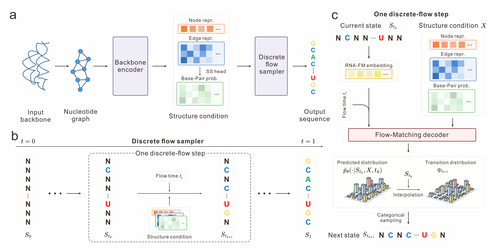

# RiboDFM: Robust RNA sequence design using backbone-conditioned discrete flow matching

## Overview

[](https://www.python.org/downloads/)
[](https://pytorch.org/)
[](https://developer.nvidia.com/cuda-toolkit)

RiboDFM is a backbone-conditioned discrete flow-matching framework for RNA sequence design. It integrates a geometric backbone encoder, an auxiliary base-pairing prediction head, and pretrained RNA-FM representations to progressively transform a fully masked sequence into a sequence compatible with the target backbone.

<p align="center">

</p>
<p align="center">
<strong>Figure 1</strong>: Overview of the RiboDFM framework.
</p>

Starting from an RNA backbone, the RiboDFM pipeline comprises the following steps:

- Constructs a residue-level graph and encodes the backbone geometry.
- Generates RNA sequences through discrete flow updates.
- Calculates a trajectory-based confidence score for each generated sequence.

In addition, RiboDFM supports zero-shot quality assessment of RNA structures.

## Installation

### Step 1. Clone the repository

```bash
git clone https://github.com/YangLab-SDU/RiboDFM.git
cd RiboDFM
```

### Step 2. Create the environment

```bash
conda create -n ribodfm python=3.9 pip -y
conda activate ribodfm
python -m pip install torch==2.0.1 --index-url https://download.pytorch.org/whl/cu118
python -m pip install -r requirements.txt
```

### Step 3. Download the network weights

```bash
wget http://yanglab.qd.sdu.edu.cn/RiboDFM/download/RiboDFM_params.tar.gz
tar -xvzf RiboDFM_params.tar.gz
```

This will create a `params/` directory containing the necessary model weights.

### Step 4. Download the RNA-FM pretrained model

```bash
mkdir -p ./params
wget -c https://huggingface.co/cuhkaih/rnafm/resolve/main/RNA-FM_pretrained.pth -O ./params/RNA-FM_pretrained.pth
# If you encounter timeout or connection errors, try downloading from our server:
# wget -c http://yanglab.qd.sdu.edu.cn/RiboDFM/download/RNA-FM_pretrained.pth -O ./params/RNA-FM_pretrained.pth
```

## Usage

### RNA sequence design

To generate one sequence for an RNA backbone:

```bash
python ./RiboDFM/Predict.py \
    --pdb ./example/9K9G.pdb \
    --rnafm-checkpoint ./params/RNA-FM_pretrained.pth \
    --temperature 0.1 \
    --num-samples 1
```

The generated sequence is saved to:

```text
./output/9K9G.fasta
```

### Zero-shot RNA structure quality assessment

To assess a candidate RNA structure:

```bash
python ./RiboDFM/QA.py \
    --pdb ./example/9K9G.pdb \
    --rnafm-checkpoint ./params/RNA-FM_pretrained.pth
```

The result is saved to:

```text
./output/9K9G_qa.txt
```

The first line is the predicted global QA score. Each subsequent line contains the PDB residue number and its predicted local QA score.

## Citation

If you use RiboDFM in your research or work, please cite the corresponding publication. Citation information will be added after publication.

```bibtex
@article{RiboDFM,
  title = {RiboDFM: Robust RNA sequence design using backbone-conditioned discrete flow matching},
  journal = {To be updated},
  year = {2026}
}
```
